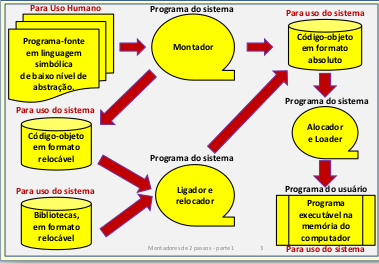
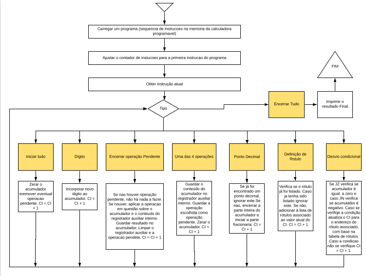

# Resolucao P1 2018 - SisProg

## Questao 1:

A imagem mostra os componentes basicos de um sistema de programacao:
1. **Montador**: Responsavel por traduzir um programa escrito em linguagem simbolica (*Assembly*) em linguagem de maquina, sendo esta em representacao binaria, hexadecimal, ASCII, ou qualquer outro tipo de representacao dos dados, desde que esteja em concordancia com o funcionamento dos outros programas de sistema. Os arquivos gerados pelo montador representam dois tipos de programas:
	1. **Programas Absolutos**: Apresenta todas as suas referencias a enderecos absolutos, podendo ser carregado diretamente para a memoria, estando pronto para execucao.
	2. **Programas Relocaveis**: Apresentam outros tipos de referencias a enderecos:
		1. *Relocaveis*: Trata-se de um caso particular do enderecamento relativo, no qual ponto de referencia fica implicito, e corresponde ao endereco relativo zero do programa relocavel.
		2. *Simbolicos*: Usados para permitir referencias mutuas (externas ou internas) atraves de rotulos simbolicos, importados ou exportados entre modulos distintos.
Esse tipo de programação permite maior modularidade e reutilizacao de codigo.
2. **Ligador / Relocador**: O ligador e responsavel por resolver referencias simbolicas externas (entre os modulos) nos programas relocaveis, produzindo um programa objeto relocavel sem referencias simbolicas. O relocador, por sua vez, resolve enderecamentos relativos, principalmente aqueles entre modulos, gerando um codigo objeto absoluto, contendo apenas enderecos abosultos ou relativos a uma base de relocacao comum (para posterior alocacao final).
3. **Alocador**: Encarregado de distribuir na memoria e associar uma base de relocacao aos programas objeto gerados pelo programas de sistema descritos acima. Desta forma, todos os enderecos do codigo serao alocados a enderecos absolutos em regioes de memoria adequadas. Nota-se que opapel do Alocador normalmente e feito pelo sistema operacional.

## Questao 2:
Existem diversas formas de se implementar um sistema de login, alem de poder se empregar tecnicas de encriptacao dos dados atraves de algoritmos de hashing, por exemplo. Porem, trago aqui a mais simples implementacao possivel, que se baseia na insercao de usuarios e senhas em um arquivo de ttexto chamado "users". Esse arquivo apresenta uma estrutura definida, na qual cada linha representa um usuario e contem duas colunas: usuario e senha. Desta maneira, o sistema de login simplesmente verifica se os dados informados pelo usuario constam no arquivo "users". Uma possivel implementacao desse sistema esta representado abaixo em C++:

´´´cpp

	bool login () {
		cout << "User: ";
		string user;
		cin >> user;
		cout << "Senha: ";
		string senha;
		cin >> senha;
		cin.ignore(256, '\n');
		fstream file("users", ios_base::in);
		
		while (file) {
			string u, p;
			file >> u >> p;
			if (user.compare(u) == 0 && senha.compare(p) == 0) {
				return true;
			}
		}
		return false;
	}
´´´

## Questao 4:

## Questao 5:
Trata-se de um conjunto de instrucoes bastante reduzido, sem suporte para endereçamentos relativos, por exemplo
